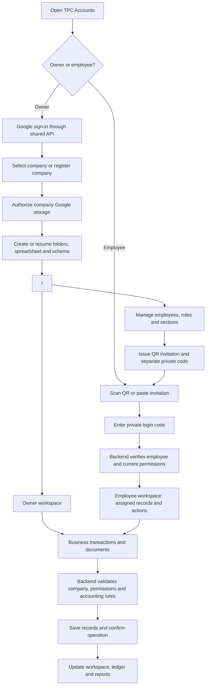
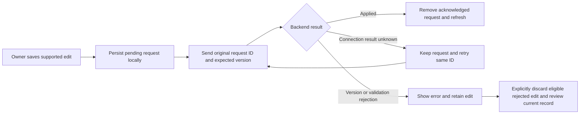

# TPC Accounts — software workflow and delivery status

Updated: 26 September 2026. Based on the repository and recorded validation results.

**Overall status: shared-backend SaaS under implementation; not ready for customer production use.**

The product remains multi-company SaaS, initially serving a small number of users.
Company owners and employees should never need to deploy scripts or edit configuration.
The software operator configures the shared infrastructure once.

“Implemented” below means available in local source and, where stated, covered by
local tests. It does not mean the latest code has been deployed or verified with
real customer data. This release is a clean launch with no legacy records to
import. Remaining financial and live-validation work is substantial.

## 1. Intended software workflow

**This diagram is the intended complete workflow.** The first production release
creates new company workspaces only. Legacy workspace adoption is outside scope.

### Owner registration and setup

1. Owner signs in with Google through the backend.
2. The backend verifies identity and resolves company ownership.
3. Owner selects a company or registers a new one.
4. Registration saves a retry identifier before submission to avoid duplicates
   after an interrupted response.
5. Owner connects Google storage through consent.
6. Backend provisions the workspace in resumable stages.
7. Once the company reaches `READY`, the owner opens the shared workspace.
8. Revoked Google access requires reconnection; existing workspace identifiers
   must be preserved.

New registration creates an empty company workspace. No old spreadsheet, local
cache, pending edit or legacy invitation is imported.

### Employee administration and login

1. Owner adds an employee and chooses role, active status and assigned sections.
2. Permissions are saved online before access is issued.
3. Backend generates an opaque invitation and a separate one-time-displayed code.
4. Owner shares the invitation/QR and private code separately.
5. Employee scans or pastes the invitation and enters the code.
6. Backend verifies credentials and establishes an expiring session.
7. Employee record requests use the employee API and current server permissions.
8. Owner can edit permissions, reset the code or revoke access.

Employees do not need Google accounts. QR codes do not contain trusted roles,
passwords or an arbitrary backend address. Employee business writes remain pending;
current shared employee record screens are read-only.

### Save, retry and conflict handling

An HTTP 200 response for a batch is not proof that every change succeeded.
Only operations explicitly marked applied are acknowledged. The implemented
queue supports pending writes; it is not a completed offline accounting workspace
or a multi-record accounting transaction engine.

## 2. Current architecture

| Layer | Current implementation | Important limit |
| --- | --- | --- |
| Flutter entrypoint | `lib/main.dart` starts `SaasApp` | No active Apps Script/direct-Sheets login fallback |
| Shared API | Node backend in `backend/cloud-run` | Latest local changes are not confirmed deployed |
| Company registry | Private Cloud Storage registry with generation checks | Whole-object size and contention need capacity testing |
| Company records | Company-owned Google Sheets | Full-table reads and manual Sheet edits limit concurrency guarantees |
| Documents | Private Google Drive files through authorized API access | Live delivery, profile display and lifecycle work remain |
| Google authorization | Backend OAuth, encrypted refresh credentials, Secret Manager/KMS | Real browser callbacks and reconnect need rollout validation |
| Background setup | Cloud Tasks and setup worker identity | Requires live retry/recovery verification |
| Browser sessions | Secure HttpOnly cookies and trusted API origin | Same-site routing must be configured and verified |
| Local pending edits | Owner/company-scoped storage and stable operation IDs | Applies only to edits created in the new SaaS flow |

The project uses Cloud Storage for the control registry. Firestore appeared in
the earlier proposal; it is not the registry used by this implementation.

Legacy source files remain for reference only. In particular,
`lib/core/auth/company_onboarding_view.dart` is not the active onboarding path.
The obsolete Apps Script backend has been removed. The current owner setup view is
`lib/core/saas/company_setup_view.dart`.

## 3. Completed implementation work

| Area | Implemented locally | Validation boundary |
| --- | --- | --- |
| Shared-only startup | New owner/employee flow; configuration failure instead of legacy fallback | App startup tests |
| Owner authentication | Verified Google identity, sessions, logout, ownership checks | Backend tests; live OAuth pending |
| Company registration | Company selection, owner membership, repeat-request protection | Retry and tenant-isolation tests |
| Provisioning | Resumable Google connection, folders, spreadsheet and schema stages | Substitute cloud adapters; live checks pending |
| Employee management | List/add/edit employees, roles, sections and active status | API/controller/widget tests |
| QR/private-code access | Issue, reset, revoke; code separate from invitation; no persisted private code | Local authentication and QR issuance tests |
| Employee permissions | Server-enforced section and record visibility; sensitive field filtering | Cross-owner/tenant and permission tests |
| Shared workspace | Owner and permission-limited employee record views | Shared API read tests |
| Customers | Owner create/edit through durable requests | Queue and API tests |
| Income and expenses | Owner create/edit; server tax/total calculation; valid dates/payment status | Exact rounding and save/retry tests |
| Financial periods | Create/edit open periods; confirmed closing; server closing metadata | Period policy and form tests |
| Period restrictions | Closed-period posting blocked; drafts block closing; overlaps rejected; periods containing journals cannot be resized/deleted | Backend tests |
| Journal foundation | Draft-first journals, balanced line validation, locked posted journals/lines | Backend tests; complete posting UI/source integration pending |
| Record API | Version checks, scoped records, references, deletion markers and ordered batches | Backend tests |
| Pending writes | Retain uncertain requests; acknowledge applied results; explicit recovery for eligible rejected edits | Restart and partial-failure tests |
| Document API | Bounded private upload/download, retry reconciliation and same-record attachment checks | Local tests; complete UI/live verification pending |
| Build/setup | Shared build script, updated setup instructions and explicit preview restriction | Script checks and debug web compilation |

## 4. Current module availability

| Module | Owner experience in new workspace | Employee experience | Remaining work |
| --- | --- | --- | --- |
| Company setup | Sign in, create/select, connect Google, refresh/retry | Not an employee action | Existing-workspace adoption and live verification |
| Employees | Administration and QR/code management | Permitted record reads | Live end-to-end test; broader HR editing integration |
| Customers | Create, edit and read | Permitted reads | Complete business workflow integration |
| Income/expenses | Create/edit unposted entries; post journals; record later full payments; reverse unpaid postings while preserving history | Permitted reads | Partial payments, paid-entry refunds, configurable tax/accounts, attachment UI and live validation |
| Financial periods | Create/edit open periods and close with restrictions | Permitted reads | Audited reopening workflow |
| Invoices/receipts | Create/edit drafts and lines; issue with server numbering and atomic receivable/revenue/VAT journal; record partial/final receipts with server allocation, balance update and Cash/Bank-to-AR journal; finalized records lock | Permitted reads | Invoice documents, credit/void/refund and receipt-reversal workflows and live validation |
| Quotations | Create/edit drafts and lines; finalize with server numbering; convert once into a copied draft invoice | Permitted reads | Documents, acceptance/expiry lifecycle and live validation |
| Payroll/payslips | Create/edit payroll drafts; server derives salary and approved overtime; approval accrues expense/liabilities; payment settles net payable | Permitted reads, subject to record scope | Payslip documents, deduction remittance, attendance locks and live validation |
| Attendance/overtime | Record viewing | Permitted reads | Authorized write/approval workflows |
| Fixed assets | Record viewing | Permitted reads | Acquisition, depreciation, disposal and ledger integration |
| Capital/equity | Record viewing | Permitted reads | Contribution/loan/equity workflows and postings |
| Journals/balance sheet | Underlying records viewable; backend journal rules exist | Permitted reads | Complete posting workflow and calculated financial statements |
| Company profile/logo | Profile records viewable; backend document support exists | Subject to settings permission | Editing/upload/display integration and verification |
| Dashboard/reports | Owner trial balance, period profit/loss and balance sheet from posted journals, with date controls and integrity checks | Reports not yet connected for employees | Dashboard, exports, remaining reports and full transaction coverage |

Granting a section does not implement missing screens or authorize writes that
the API does not support. Readable journal records are not a completed balance
sheet or reporting module.

## 5. Pending work, in dependency order

| Priority | Work | Completion evidence required |
| --- | --- | --- |
| P0 | Complete accounting transaction contracts | Authoritative totals, account validation, finalized-record controls, payment limits and recoverable multi-record operations |
| P0 | Connect source transactions to ledger | Invoice, receipt, income, expense, payroll, asset and capital events produce correct postings once, including interrupted/repeated requests |
| P0 | Implement financial write screens | Supported business workflows work through the shared API, with clear errors and preserved pending edits |
| P0 | Complete reports/dashboard | Trial balance, P&L, balance sheet and relevant reports reconcile to posted shared records |
| P0 | Verify live authentication and routing | Trusted app/API origins, HTTPS, OAuth callbacks, cookie behavior, logout and reconnect work in real browsers |
| P0 | Test two unrelated live companies | Altered company, record, employee and document IDs cannot cross company boundaries |
| P0 | Validate real employee journey | Owner issues QR; camera/link login works; permissions change promptly; reset/revocation and owner-offline access work |
| P1 | Complete private document UI | Logos/profile images and accounting documents upload, attach and display through authorized access |
| P1 | Add employee business writes | Explicit action permissions, field/record restrictions and audit coverage for each supported action |
| P1 | Finish document lifecycle | Recovery/cancellation, retention/deletion policy and content handling decisions are implemented and tested |
| P1 | Production operations | Monitoring, redacted logs, backup/restore, abuse protection, capacity tests and practical resource limits |
| P1 | Hosting and cost review | Confirm an appropriate hosting plan, estimate low-volume costs and configure monitoring; zero cost is not guaranteed |
| Release | Deploy and verify compatible versions | Updated backend first, then configured frontend; smoke tests and deployment rollback verified |

P0 items block a complete customer production release. P1 items also need a
reviewed launch decision; their priority does not mean they can be silently skipped.

## 6. Deployment and testing status

### Last recorded cloud verification

- Google project: `accounts-508118`, project number `110697421185`.
- Cloud Run: `tpc-accounts-api`, region `me-central1`.
- Last recorded successful revision: `tpc-accounts-api-00002-kxf` on 24 September.
- `/health` passed the operator's check; unauthenticated `/v1/me` returned the
  expected application JSON 401. Use `/health`, not the earlier `/healthz` check.
- Latest local frontend and accounting-policy changes are **not confirmed deployed**.
- No load balancer was reported created. Same-site API routing and live OAuth
  remain unverified. This document does not independently recheck current cloud state.

### Recorded local validation

- Latest full backend run: **170 tests passed**. Payroll tests cover server-derived
  salary/overtime totals, duplicate and transition guards, balanced approval and
  payment journals, closed periods, and lost-response replay. The full **181-test
  Flutter suite** passed. Quotation tests cover authoritative
  totals, date/prefix validation, finalization locks, yearly numbering, atomic
  draft-invoice conversion and lost-response replay. Receipt tests cover payment
  limits, customer/currency/date/period checks, partial and final allocation,
  server numbering, balanced journals, write locks and lost-response replay.
  Eight focused Flutter receipt/invoice/queue tests and the full **179-test Flutter suite** passed. Invoice issuing tests cover yearly
  server numbering, open periods, prefix validation, balanced journals, locking,
  retries and prevention of duplicate journals. Invoice draft tests cover exact
  line rounding, discount/tax limits, finalized locks, forged totals, atomic header
  refresh and lost-response recovery without duplicate updates. Two Flutter form
  tests verify source-only draft and line submissions; the queue test also verifies
  issuing contains no client-controlled values.
  Balance-sheet tests cover earnings,
  closing transfers without double-counting, signed contra balances, tenant denial,
  date query validation and private caching. Three report widget tests passed.
  Profit/loss tests cover inclusive
  dates, exact signed results, expense losses and reversals in a later period.
  Trial-balance tests cover exact
  balances, cutoffs, reversals, corrupt-ledger rejection, scoped owner access,
  revoked sessions, pending writes and HTTP query/cache behavior. The report
  widget test verifies stale totals disappear when refresh fails.
  Unpaid-reversal tests cover
  balanced cancellation, preserved history, date restrictions, duplicate requests
  and lost responses. Later full-payment tests cover
  atomic settlement, closed dates, duplicate requests, lost responses, forged
  amounts and inconsistent control balances. Four focused Flutter payment/queue
  tests passed. Explicit owner cash-entry posting
  saves source and journals atomically, validates both accounting dates, and
  reconciles lost responses without duplicate posting. Five focused Flutter
  queue/editor tests passed in the preceding milestone. Paid-entry refunds and receipt reversal remain unfinished.
  Linked income/expense entries
  reject standalone edits and deletion until coordinated correction is available.
  The obsolete Apps Script backend and its own tests have been removed; active
  Cloud Run code and legacy accounting migration references remain.
  The internal Sheets writer can
  submit multiple records in one atomic batch, rejects invalid members before
  submission, and preserves uncertain-response handling. Explicit income/expense
  posting uses this primitive. Draft journal saves now reject
  duplicate line numbers on creation, renumbering and moves between drafts.
  Tests cover tenant boundaries, deleted lines and updates to the same line.
- Latest financial-period work: **four focused Flutter tests passed**, with
  targeted analyzer checks passing.
- Income/expense work: **five focused Flutter tests passed**; debug web compilation succeeded.
- Earlier shared-only cutover: **158 full Flutter tests passed**. This is a
  historical full-suite result, not a claim that every later change had a fresh
  full-suite run. Do not add counts from overlapping runs together.
- Substitute cloud adapters and local tests do not establish production readiness.

## 7. Operator work versus customer work

| Software operator — one-time setup/rollout | Company owner — normal product use |
| --- | --- |
| Cloud project, API hosting and trusted domains | Google sign-in |
| OAuth configuration, secret storage and encryption | Company details and storage consent |
| Task identities, storage permissions and monitoring | Add employees and assign access |
| Frontend build configuration and deployment | Issue employee invitations/private codes |
| Migration tools, backups and release verification | Use accounting features and reconnect Google if needed |

Employees only need their invitation and private code. Customers should not edit
JSON configuration, run Cloud Shell commands or create Apps Script projects.

## 8. Release checklist

- [x] Shared-only application entrypoint.
- [x] Local company setup and employee administration implementation.
- [x] Shared record reads and supported owner writes.
- [x] Local money-validation, journal and financial-period safeguards.
- [ ] Complete source-transaction ledger integration and financial write workflows.
- [ ] Complete reporting and document/profile integration.
- [x] Confirm clean launch: no legacy records, queues or invitations will be imported.
- [ ] Verify real owner and employee journeys across two companies.
- [ ] Verify infrastructure, backups, monitoring and restore procedures.
- [ ] Deploy compatible backend/frontend versions and pass live smoke tests.
- [ ] Remove the preview restriction only after the release checks pass.

## Source files and supporting documents

- [Current setup instructions](SETUP.md)
- [Backend release status](backend/cloud-run/RELEASE_STATUS.md)
- [Validation history](VALIDATION.md)
- [Backend API contract](backend/cloud-run/API.md)
- [Shared application entry](lib/main.dart)
- [Owner/employee routing](lib/core/saas/saas_app.dart)
- [Shared workspace](lib/core/saas/shared_workspace.dart)
- [Frontend build script](scripts/build-shared-web.sh)
- [Backend deployment script](backend/cloud-run/deploy-cloud-shell.sh)

Some older documents describe earlier milestones. Use this dated consolidated
status together with the latest source and validation entries, rather than treating
historical “pending” statements as the current status.
