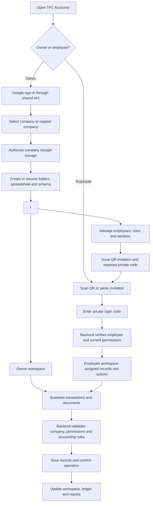
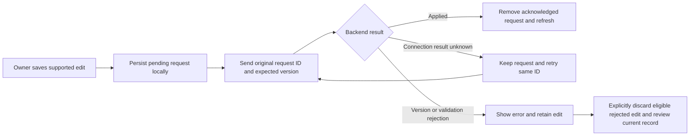

# TPC Accounts — software workflow and delivery status

Updated: 4 October 2026. Based on the repository and recorded validation results.

**Overall status: shared-backend SaaS under implementation; not ready for customer production use.**

The product remains multi-company SaaS, initially serving a small number of users.
Company owners and employees should never need to deploy scripts or edit configuration.
The software operator configures the shared infrastructure once.

“Implemented” below means available in local source and, where stated, covered by
local tests. It does not mean the latest code has been deployed or verified with
real customer data. This release is a clean launch with no legacy records to
import. Remaining financial and live-validation work is substantial.

## 1. Intended software workflow

**This diagram is the intended complete workflow.** The first production release
creates new company workspaces only. Legacy workspace adoption is outside scope.

### Owner registration and setup

1. Owner signs in with Google through the backend.
2. The backend verifies identity and resolves company ownership.
3. Owner selects a company or registers a new one.
4. Registration saves a retry identifier before submission to avoid duplicates
   after an interrupted response.
5. Owner connects Google storage through consent.
6. Backend provisions the workspace in resumable stages.
7. Once the company reaches `READY`, the owner opens the shared workspace.
8. Revoked Google access requires reconnection; existing workspace identifiers
   must be preserved.

New registration creates an empty company workspace. No old spreadsheet, local
cache, pending edit or legacy invitation is imported.

### Employee administration and login

1. Owner adds an employee and chooses role, active status and assigned sections.
2. Permissions are saved online before access is issued.
3. Backend generates an opaque invitation and a separate one-time-displayed code.
4. Owner shares the invitation/QR and private code separately.
5. Employee scans or pastes the invitation and enters the code.
6. Backend verifies credentials and establishes an expiring session.
7. Employee record requests use the employee API and current server permissions.
8. Owner can edit permissions, reset the code or revoke access.

Employees do not need Google accounts. QR codes do not contain trusted roles,
passwords or an arbitrary backend address. Employee business writes remain pending;
current shared employee record screens are read-only.

### Save, retry and conflict handling

An HTTP 200 response for a batch is not proof that every change succeeded.
Only operations explicitly marked applied are acknowledged. The implemented
queue supports pending writes; it is not a completed offline accounting workspace
or a multi-record accounting transaction engine.

## 2. Current architecture

| Layer | Current implementation | Important limit |
| --- | --- | --- |
| Flutter entrypoint | `lib/main.dart` starts `SaasApp` | No active Apps Script/direct-Sheets login fallback |
| Shared API | Node backend in `backend/cloud-run` | Current source deployed 4 October; authenticated live validation remains |
| Company registry | Private Cloud Storage registry with generation checks | Whole-object size and contention need capacity testing |
| Company records | Company-owned Google Sheets | Full-table reads and manual Sheet edits limit concurrency guarantees |
| Documents | Private Google Drive files, record attachment browser, profile/logo editing and PDF creation through authorized API access | Live delivery, multilingual PDF fonts and lifecycle work remain |
| Google authorization | Backend OAuth, encrypted refresh credentials, Secret Manager/KMS | Real browser callbacks and reconnect need rollout validation |
| Background setup | Cloud Tasks and setup worker identity | Requires live retry/recovery verification |
| Browser sessions | Secure HttpOnly cookies and trusted API origin | Same-site routing must be configured and verified |
| Local pending edits | Owner/company-scoped storage and stable operation IDs | Applies only to edits created in the new SaaS flow |

The project uses Cloud Storage for the control registry. Firestore appeared in
the earlier proposal; it is not the registry used by this implementation.

Legacy source files remain for reference only. In particular,
`lib/core/auth/company_onboarding_view.dart` is not the active onboarding path.
The obsolete Apps Script backend has been removed. The current owner setup view is
`lib/core/saas/company_setup_view.dart`.

## 3. Completed implementation work

| Area | Implemented locally | Validation boundary |
| --- | --- | --- |
| Shared-only startup | New owner/employee flow; configuration failure instead of legacy fallback | App startup tests |
| Owner authentication | Verified Google identity, sessions, logout, ownership checks | Backend tests; live OAuth pending |
| Company registration | Company selection, owner membership, repeat-request protection | Retry and tenant-isolation tests |
| Provisioning | Resumable Google connection, folders, spreadsheet and schema stages | Substitute cloud adapters; live checks pending |
| Employee management | List/add/edit employees, roles, sections and active status | API/controller/widget tests |
| QR/private-code access | Issue, reset, revoke; code separate from invitation; no persisted private code | Local authentication and QR issuance tests |
| Employee permissions | Server-enforced section and record visibility; sensitive field filtering | Cross-owner/tenant and permission tests |
| Shared workspace | Owner and permission-limited employee record views | Shared API read tests |
| Customers | Owner create/edit through durable requests | Queue and API tests |
| Income and expenses | Owner create/edit; server tax/total calculation; valid dates/payment status | Exact rounding and save/retry tests |
| Financial periods | Create/edit open periods; confirmed closing; server closing metadata | Period policy and form tests |
| Period restrictions | Closed-period posting blocked; drafts block closing; overlaps rejected; periods containing journals cannot be resized/deleted | Backend tests |
| Journal foundation | Draft-first manual journals, balanced line validation, locked posted journals/lines, and server-owned source postings | Backend policy, report and retry tests |
| Record API | Version checks, scoped records, references, deletion markers and ordered batches | Backend tests |
| Pending writes | Retain uncertain requests; acknowledge applied results; explicit recovery for eligible rejected edits | Restart and partial-failure tests |
| Document API | Bounded private upload/download, retry reconciliation and same-record attachment checks | Local tests; complete UI/live verification pending |
| Build/setup | Shared release build script and updated setup instructions; preview gate removed 4 October | Trusted HTTPS API origin remains required |

## 4. Current module availability

| Module | Owner experience in new workspace | Employee experience | Remaining work |
| --- | --- | --- | --- |
| Company setup | Sign in, create/select, connect Google, refresh/retry | Not an employee action | Live clean-workspace verification |
| Employees | Administration and QR/code management | Permitted record reads | Live end-to-end test; broader HR editing integration |
| Customers | Create, edit and read | Permitted reads | Complete business workflow integration |
| Income/expenses | Create/edit unposted entries; post accrual/payment journals; record later full payments; reverse unpaid entries; refund and reverse paid entries | Permitted reads | Partial settlements, configurable tax/accounts, live attachment verification |
| Financial periods | Create/edit open periods and close with restrictions | Permitted reads | Audited reopening workflow |
| Invoices/receipts | Create/edit drafts and lines; issue with server numbering and atomic receivable/revenue/VAT journal; record partial/final receipts; reverse receipts; void zero-paid issued invoices with exact journal reversal | Permitted reads | Partial credit notes and live document verification |
| Quotations | Create/edit drafts and lines; finalize with server numbering; convert once into a copied draft invoice | Permitted reads | Acceptance/expiry lifecycle and live document verification |
| Payroll/payslips | Create/edit payroll drafts; server derives salary and approved overtime; approval/payment journals; approved or paid payroll reversal/refund | Permitted reads, subject to record scope | Deduction remittance, attendance locks and live document verification |
| Fixed assets | Create/edit drafts; capitalize paid purchases; post straight-line depreciation; dispose with proceeds and gain/loss journal | Permitted reads, subject to record scope | Impairment, transfers, alternative depreciation and live document verification |
| Attendance/overtime | Record viewing | Permitted reads | Authorized write/approval workflows |
| Capital/equity | Create/edit shareholders, post Cash/Bank contributions, record interest-free shareholder loans and full repayments | Permitted reads | Distributions, interest accrual, partial loan repayment and percentage-history workflows |
| Journals/balance sheet | Source postings and manual draft/post rules; trial balance, profit/loss and balance sheet calculated from posted journals | Permitted reads | Manual journal editor and export/live validation |
| Company profile/logo | Durable profile editing; upload, select, remove and display private logos; profile and logo included in generated PDFs | Read/display subject to settings permission | Live verification and multilingual PDF fonts |
| Dashboard/reports | Dashboard, trial balance, period profit/loss, balance sheet and general ledger with opening/running/closing balances; date controls and CSV exports | Company-wide Reports permission required; server rechecks current permission | Live reconciliation and specialized aging/cash-flow reports outside this initial scope |

Granting a section does not implement missing screens or authorize writes that
the API does not support. Readable journal records are not a completed balance
sheet or reporting module.

## 5. Pending work, in dependency order

| Priority | Work | Completion evidence required |
| --- | --- | --- |
| Done | Complete accounting transaction contracts | Authoritative totals, finalized-record controls, payment limits and retry-safe multi-record operations are covered by backend tests |
| Done | Connect supported source transactions to ledger | Invoice, receipt, income, expense, payroll, asset, capital and shareholder-loan events post once, including corrections and interrupted requests |
| Done | Implement supported financial write screens | Owner actions use the shared API and durable queue, with correction dialogs and recoverable errors |
| Done locally | Complete initial reports/dashboard | Dashboard, trial balance, P&L, balance sheet and general ledger derive from validated posted journals; CSV export and employee Reports access are connected |
| P0 | Verify live authentication and routing | Trusted app/API origins, HTTPS, OAuth callbacks, cookie behavior, logout and reconnect work in real browsers |
| P0 | Test two unrelated live companies | Altered company, record, employee and document IDs cannot cross company boundaries |
| P0 | Validate real employee journey | Owner issues QR; camera/link login works; permissions change promptly; reset/revocation and owner-offline access work |
| Done locally | Complete initial private document/profile UI | Profile editor, private logo display, record document lists, bounded uploads, durable upload retries, image viewing and web downloads; English PDF generation for invoices, quotations, receipts, payroll and assets |
| P1 | Add employee business writes | Explicit action permissions, field/record restrictions and audit coverage for each supported action |
| P1 | Finish document lifecycle | Recovery/cancellation, retention/deletion policy and content handling decisions are implemented and tested |
| P1 | Production operations | Monitoring, redacted logs, backup/restore, abuse protection, capacity tests and practical resource limits |
| P1 | Hosting and cost review | Confirm an appropriate hosting plan, estimate low-volume costs and configure monitoring; zero cost is not guaranteed |
| Release | Deploy and verify compatible versions | Updated backend first, then configured frontend; smoke tests and deployment rollback verified |

P0 items block a complete customer production release. P1 items also need a
reviewed launch decision; their priority does not mean they can be silently skipped.

## 6. Deployment and testing status

### Historical cloud verification (superseded by the release below)

- Google project: `accounts-508118`, project number `110697421185`.
- Cloud Run: `tpc-accounts-api`, region `me-central1`.
- Last recorded successful revision: `tpc-accounts-api-00002-kxf` on 24 September.
- `/health` passed the operator's check; unauthenticated `/v1/me` returned the
  expected application JSON 401. Use `/health`, not the earlier `/healthz` check.
- Latest local frontend and accounting-policy changes are **not confirmed deployed**.
- No load balancer was reported created. Same-site API routing and live OAuth
  remain unverified. This document does not independently recheck current cloud state.

### Release verification — 4 October 2026 (Asia/Dubai)

Backend and frontend were deployed from clean source commit `ebe4196` (backend first).
This is an operator-validation release; the outstanding P0 customer-release checks
remain open. Existing Cloud Run environment, identities and infrastructure were preserved.

- Cloud Build: `91ca0bfe-19a0-4087-9fda-af902284ac56`, successful; backend tests also ran in the build.
- Cloud Run: `tpc-accounts-api-00004-4b6`, serving 100% of traffic.
- Immutable API image: `me-central1-docker.pkg.dev/accounts-508118/tpc-backend-v2/api@sha256:a034549849a2e7bf3557b40ff39aa5cf35ea38826ebfdc3f09c9835ddcfc05f4`.
- Vercel deployment: `dpl_6pa8nb5toHZtuNDW15jeDfCLgfEy`, READY, production target.
- Website: https://accounts.thepercentagecompany.com ; frontend built with this same `SAAS_API_ORIGIN`.
- Local validation: **195 backend tests passed**, **189 Flutter tests passed**, release web build succeeded.
- Live HTTP smoke checks passed: phase-4 health; owner JSON 401 and private no-store/CORS headers;
  employee JSON 401 (`EMPLOYEE_ACCESS_DENIED`); credentialed employee-login preflight;
  untrusted-origin 403; missing-CSRF 403; OAuth initiation with the exact website callback
  and Secure/HttpOnly/host-scoped/Lax binding cookie. OAuth state/cookie values were not logged.
- Live `/`, `/flutter_bootstrap.js` and `/main.dart.js` matched local release assets by SHA-256.
  Compiled JavaScript SHA-256: `7bef31538275d5d0aa7e87a8f99405e3663937486ce12d150a762ba0d4272492`.
- Browser automation was unavailable. Completed Google sign-in/callback, session persistence,
  logout/reconnect, two-company isolation, provisioning and employee journeys were **not verified**.
- Rollback execution was **not tested**. Prior API revision `tpc-accounts-api-00003-rqx`
  is the recorded backend rollback target. Backend rollback command:
  `gcloud run services update-traffic tpc-accounts-api --to-revisions=tpc-accounts-api-00003-rqx=100 --region=me-central1 --project=accounts-508118`.
  Coordinate any frontend rollback through Vercel deployment history; do not assume an older
  frontend remains compatible with this release's API.

### Recorded local validation (historical)

- Latest full backend run: **187 tests passed**. Payroll, fixed-asset and capital tests cover server-derived
  salary/overtime totals, duplicate and transition guards, balanced approval and
  payment journals, closed periods, and lost-response replay. The full **181-test
  Flutter suite** passed. Quotation tests cover authoritative
  totals, date/prefix validation, finalization locks, yearly numbering, atomic
  draft-invoice conversion and lost-response replay. Receipt tests cover payment
  limits, customer/currency/date/period checks, partial and final allocation,
  server numbering, balanced journals, write locks and lost-response replay.
  Eight focused Flutter receipt/invoice/queue tests and the full **179-test Flutter suite** passed. Invoice issuing tests cover yearly
  server numbering, open periods, prefix validation, balanced journals, locking,
  retries and prevention of duplicate journals. Invoice draft tests cover exact
  line rounding, discount/tax limits, finalized locks, forged totals, atomic header
  refresh and lost-response recovery without duplicate updates. Two Flutter form
  tests verify source-only draft and line submissions; the queue test also verifies
  issuing contains no client-controlled values.
  Balance-sheet tests cover earnings,
  closing transfers without double-counting, signed contra balances, tenant denial,
  date query validation and private caching. Three report widget tests passed.
  Profit/loss tests cover inclusive
  dates, exact signed results, expense losses and reversals in a later period.
  Trial-balance tests cover exact
  balances, cutoffs, reversals, corrupt-ledger rejection, scoped owner access,
  revoked sessions, pending writes and HTTP query/cache behavior. The report
  widget test verifies stale totals disappear when refresh fails.
  Unpaid-reversal tests cover
  balanced cancellation, preserved history, date restrictions, duplicate requests
  and lost responses. Later full-payment tests cover
  atomic settlement, closed dates, duplicate requests, lost responses, forged
  amounts and inconsistent control balances. Four focused Flutter payment/queue
  tests passed. Explicit owner cash-entry posting
  saves source and journals atomically, validates both accounting dates, and
  reconciles lost responses without duplicate posting. Five focused Flutter
  queue/editor tests passed in the preceding milestone. Paid-entry refunds, receipt reversal,
  invoice voiding, payroll reversal, asset disposal and shareholder-loan workflows now have server policies and tests.
  Linked income/expense entries
  reject standalone edits and deletion until coordinated correction is available.
  The obsolete Apps Script backend and its own tests have been removed; active
  Cloud Run code and historical legacy accounting references remain.
  The internal Sheets writer can
  submit multiple records in one atomic batch, rejects invalid members before
  submission, and preserves uncertain-response handling. Explicit income/expense
  posting uses this primitive. Draft journal saves now reject
  duplicate line numbers on creation, renumbering and moves between drafts.
  Tests cover tenant boundaries, deleted lines and updates to the same line.
- Latest financial-period work: **four focused Flutter tests passed**, with
  targeted analyzer checks passing.
- Income/expense work: **five focused Flutter tests passed**; debug web compilation succeeded.
- Latest full Flutter run: **181 tests passed** after the source-transaction UI changes.
- Substitute cloud adapters and local tests do not establish production readiness.

## 7. Operator work versus customer work

| Software operator — one-time setup/rollout | Company owner — normal product use |
| --- | --- |
| Cloud project, API hosting and trusted domains | Google sign-in |
| OAuth configuration, secret storage and encryption | Company details and storage consent |
| Task identities, storage permissions and monitoring | Add employees and assign access |
| Frontend build configuration and deployment | Issue employee invitations/private codes |
| Migration tools, backups and release verification | Use accounting features and reconnect Google if needed |

Employees only need their invitation and private code. Customers should not edit
JSON configuration, run Cloud Shell commands or create Apps Script projects.

## 8. Release checklist

- [x] Shared-only application entrypoint.
- [x] Local company setup and employee administration implementation.
- [x] Shared record reads and supported owner writes.
- [x] Local money-validation, journal and financial-period safeguards.
- [x] Complete source-transaction ledger integration and financial write workflows for the initial supported accounting scope.
- [x] Complete initial local reporting and document/profile integration (scope and validation limits below).
- [x] Confirm clean launch: no legacy records, queues or invitations will be imported.
- [ ] Verify real owner and employee journeys across two companies.
  Public health/authentication-boundary/CORS checks pass; authenticated verification
  is blocked because no browser is connected. See [live test matrix](LIVE_JOURNEY_VERIFICATION.md).
- [ ] Verify infrastructure, backups, monitoring and restore procedures.
  Live runtime, IAM boundaries, registry versioning/soft deletion and read-only
  generation recovery were checked on 4 October 2026. Monitoring, independent
  backups, company-data recovery and a safe write-restore drill are not complete.
  See [verification evidence](INFRASTRUCTURE_BACKUP_MONITORING_VERIFICATION.md).
- [ ] Deploy compatible backend/frontend versions and pass live smoke tests.
- [x] Remove the preview build restriction (4 October, operator request); outstanding live release checks remain tracked above.

## Source files and supporting documents

### Reporting and document integration validation — 2 October 2026

- Backend: **195 tests passed**. Includes exact general-ledger opening/closing
  reconciliation, dashboard totals, employee report permission revocation,
  private document listing, and profile validation/currency locking.
- Full Flutter suite: **188 tests passed** before the additional employee-report
  routing check; targeted analyzer passed. Final focused checks are recorded in
  `VALIDATION.md`.
- Documents attach through the private registry's parent-record relationship,
  including finalized transactions, without changing locked financial values.
  Payroll PDFs attach directly to Payroll and inherit its employee record scope.
- Upload contents and the original request ID persist locally, scoped to owner
  and company, until acknowledged. Uncertain uploads must be retried; cancellation,
  retention/deletion and broader document lifecycle remain separate pending work.
- Generated documents use saved totals, profile/bank details and the private logo.
  They are version-labelled snapshots, not immutable server-signed originals.
  Automatic PDF generation currently accepts English/ASCII text; other scripts
  require uploading a prepared PDF. Downloads/CSV exports currently target web.
- PDF visual layout review and real Google Drive delivery remain live release
  checks. Local tests and compilation do not establish production readiness.

- [Current setup instructions](SETUP.md)
- [Backend release status](backend/cloud-run/RELEASE_STATUS.md)
- [Validation history](VALIDATION.md)
- [Backend API contract](backend/cloud-run/API.md)
- [Shared application entry](lib/main.dart)
- [Owner/employee routing](lib/core/saas/saas_app.dart)
- [Shared workspace](lib/core/saas/shared_workspace.dart)
- [Frontend build script](scripts/build-shared-web.sh)
- [Backend deployment script](backend/cloud-run/deploy-cloud-shell.sh)

Some older documents describe earlier milestones. Use this dated consolidated
status together with the latest source and validation entries, rather than treating
historical “pending” statements as the current status.

### UI refresh — 4 October 2026

- Active shared workspace uses a responsive desktop sidebar and mobile section selector.
- Appearance menu on owner/employee entry screens and workspace provides Light, Dark and System; choice persists locally.
- Workspace reports open with a financial quick view using server dashboard totals. Cards group period performance and cumulative cash/financial position, with formatted amounts and no fabricated trends.
- Shared records support filtering by displayed name, number and status. Global themes update cards, controls and app bars across screens.
- Validation: existing full Flutter suite passed (189 tests); five new theme/layout checks passed; eight focused workspace, employee access and design checks passed after the final search changes. Changed files pass analyzer. Full-project analyzer reports existing issues outside changed files.
- These are local source changes; no deployment or authenticated browser visual review is claimed.
- Release web build succeeded with the configured shared API origin.
