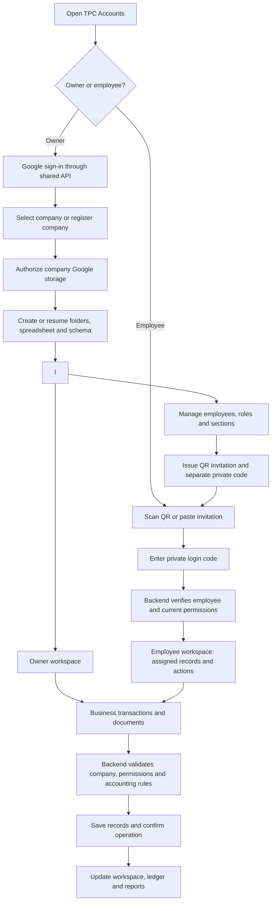
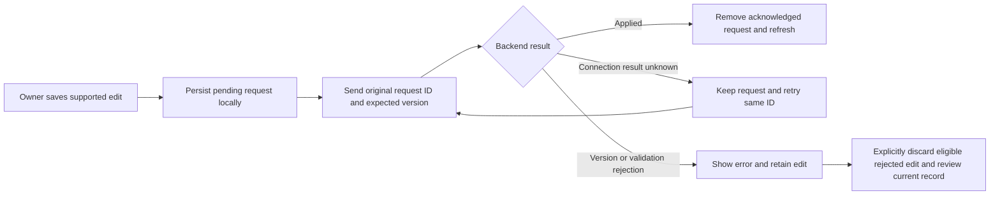

# TPC Accounts — software workflow and delivery status

Updated: 4 October 2026. Based on the repository and recorded validation results.

### Responsive workspace and feature architecture - 4 October 2026

Compact controls now extend to every shared record section: record type and
multi-select status filters use right-aligned menus, refresh uses an icon,
creation retains one primary action, and pending-write recovery uses an options
menu. Selected statuses remain visible in a small summary; search has a clear
action. Employee controls align right with icon refresh. Invoice/quotation and
document PDF styles use compact menus; document actions align right. Workspace
deletion is under Workspace options and retains the permanent-deletion dialog.
Form data choices and save/cancel actions remain explicit. The full Flutter
regression suite passed 132 tests with one existing skip, including status filter
selection/reset, workspace deletion and responsive navigation.

Dashboard refinement: replaced the visible report/date chip rows and central CSV
button with one right-aligned toolbar. Report selection, calendar presets/custom
range, refresh and an options menu retain all existing reports and CSV export.
The content keeps period/journal metadata and ledger balance status, all ten
financial totals, and two compact comparison graphs (income/spending and cash/bank).
Graphs use absolute current totals with signed values retained in summaries;
no historical trend is inferred. Missing/non-finite values display an unavailable
state. Calendar filtering and report/export menu navigation passed regression
checks; 27 focused tests passed and static analysis was clean.

The reference style now applies across the application through shared theme and
form components: white navigation with soft blue selection, neutral canvas,
bordered cards, consistent desktop dialog headers/actions, responsive document
dialogs, table headers, menus, sheets and record expansion surfaces. Accounting,
customer, payroll and invoice/quotation forms reuse the same dialog treatment.
Employee cards include identity icons; employee access has a clearer entrance and
a reserved loading area. Status badges use semantic colors in light mode and
monochrome styling in dark mode. All dark surface levels, inverse colors,
navigation, menus and actions use black/grey/white. Dashboard income/spending
comparison uses real totals with reduced-motion-aware animation.
Full regression suite: 130 tests passed, one existing skip. Ten phone/desktop
light/dark preview checks passed; renders inspected. Changes remain local.

Workspace setup now uses a searchable directory and a selected-company overview
with status, connection/retry actions and an integrated Open workspace button.
Company creation expands within its own card. Deletion confirmation names the
company and explains all removed data; cancellation preserves the workspace.
Desktop uses two columns, mobile stacks the cards, and both follow light/dark
appearance. A short card entrance and animated form expansion respect reduced
motion settings. Existing session provisioning and deletion methods are reused.
Ten focused setup/session tests passed and the release web build succeeded.

Local UI changes reuse the active workspace, dashboard, editors, queues and API.
Desktop uses a navy sidebar, section search, workspace breadcrumbs and bordered
cards. Mobile keeps bottom navigation and presents report selection in a compact
menu with a calendar range picker. Invoice/quotation editing includes a live
desktop preview; mobile retains the full-screen editor and explicit PDF preview.
Appearance selection persists light/dark/system preferences. Dark surfaces,
navigation, metrics and actions use black, grey and white.

Loading uses Cupertino activity indicators in reserved inline areas. Record and
employee refreshes keep existing rows visible without shifting them; pull-to-refresh
uses the same inline indication rather than adding an overlay spinner.

The former lib/core/saas tree was moved into features/auth, workspace, documents,
accounting, customers, employees and reports, plus shared core/network, cache and
widgets/forms folders. Imports and test references point to the new files; no
forwarding copies of the old tree remain. Session and employee administration use
Bloc/Cubit and generated Freezed snapshots. Authentication consumes a domain
repository contract; local form inputs remain in the existing StatefulWidgets.
Regenerate state with flutter pub run build_runner build after changing declarations.

Validation: the full Flutter suite passed 126 tests with one existing skip. The
final responsive/theme/loading/report checks passed 20 targeted tests. Phone and
desktop invoice/dashboard renders were inspected in light and dark modes.
Static analysis found no issues. A configured release web build succeeded.
These UI changes have not been deployed to production.

### Complete draft API and item returns - 4 October 2026

Released to production on 4 October 2026: Cloud Run revision
`tpc-accounts-api-00006-sox` serves 100% of API traffic. Vercel deployment
`dpl_GaKqpkVXfVbmy2KXFhtiK6NgefRF` was promoted to
https://accounts.thepercentagecompany.com. The public JavaScript SHA-256 matches
the tested local release build. Live health advertises both capabilities and
public routing/authentication-boundary/CORS checks pass. Cloud Build passed all
213 backend tests; 28 targeted Flutter tests passed, static analysis was clean,
and the release web build/Wasm dry run succeeded. An authenticated customer
invoice/return transaction was not performed during deployment verification.

Verified the live revision tpc-accounts-api-00005-bfv was built from source that
did not accept values.items. This caused the new invoice/quotation editor to fail
with INVALID_RECORD despite the local implementation supporting complete drafts.
The release now advertises complete-document-drafts and invoice-item-returns in
the health response so deployment compatibility can be checked directly.

Issued invoices remain immutable. Return items / credit note accepts selected
original lines and partial quantities. Server-controlled prices, proportional
discounts and VAT use cumulative minor-unit rounding, preventing excess returns
and ensuring a complete return totals exactly to the original invoice. Credit
notes and their item rows are posted atomically with the invoice balance and
balanced return/refund journal. Excess credit is an immediate Cash/Bank refund;
the UI displays estimated credit/refund and explains when to post it. Refunds
are recorded, not transferred by this application. Original receipts with refunds
cannot be reversed. Unrefunded partial returns allow subsequent receipt posting.

CreditNotes and CreditNoteItems are additive spreadsheet tabs with headers,
created atomically on first use for existing companies. Original tabs/headers
are preserved. Credit notes are read-only, available under Invoices, and support
invoice_kit PDF exports linked to the original invoice. Employee access follows
the existing Invoices section permission.

### Workspace deletion - 4 October 2026

Company setup now offers an owner-only Delete workspace action with explicit
permanent-deletion confirmation. DELETE /v1/companies/:companyId blocks active
setup/writes, marks the workspace DELETING, permanently removes Google Drive
resources tagged for that company (including moved uploads), then removes the
company and its memberships, employee sessions, OAuth transactions and registration
entries from the control registry. Failed Drive cleanup retains the workspace for
retry; normal setup and writes cannot resume during deletion. Local workspace
caches and owner write/upload/employee queues are removed after server completion.
Other companies and the owner's sign-in account remain available. Deploy the
backend before the frontend to enable this endpoint.

### Saved invoice grey-screen fix - 4 October 2026

Reproduced the saved-record expansion failure in a widget regression test:
SelectableText's internal scroll restoration read the expansion tile's boolean
state as a double. Replaced record-detail SelectableText with SelectionArea and
Text, preserving copying without the conflicting scroll state. The regression
passes after the change.

Removed the separate invoice/quotation line editors and their navigation entries;
complete documents now use the shared multi-item editor exclusively. Child item
tables remain required for storage, permissions, PDFs and atomic document writes.
Saved drafts have a visible title, save completion forces a fresh record read,
and missing customer choices no longer crash the dropdown.

Validated 30 relevant widget/PDF/workspace tests and static analysis. These changes
are local. The release web build and Wasm dry run succeeded; build/web is ready
for frontend deployment. The live frontend must be deployed to receive the fix.

### Advanced invoice and quotation creation ? 4 October 2026

Implemented locally: invoice_kit 0.2.0 with a shared multi-item invoice/quotation
editor, customer details, currency, notes/terms, duplicate/remove/reorder actions,
per-line discounts and tax, rounded estimates and Modern/Classic PDF previews.
Saved invoice/quotation PDFs use invoice_kit custom branded templates and saved
server totals; receipts/payslips/assets retain their existing templates.

Complete drafts save their header and 1?100 lines in one idempotent atomic
backend operation. Updating draft lines soft-deletes the previous lines.
Version checks prevent overwriting concurrent edits; existing numbering,
issue/send and posting workflows remain separate. Product references stay
company-scoped. The operation passes through the existing durable pending queue.

All existing editable date fields now open calendars on desktop and mobile,
including receipts, cash/payment/reversal entries, financial periods, assets,
capital and payroll payments. Payroll month uses a month calendar; report dates
use calendar selection. Optional dates can be cleared. A reusable clock/date-time
picker stores 24-hour values. Attendance/Overtime currently have no editable
time forms, and audit timestamps remain generated/read-only.

Validation: 108 Flutter tests passed (one browser-only skip), 207 backend tests
passed, and phone/desktop editor renders were reviewed. Targeted checks cover
picker selection/cancellation, multi-line editing, financial rounding, saved PDF
totals, atomic creation/replacement, replay after lost responses, stale versions,
100-line bounds and tenant-scoped references. Analysis has only the existing
dart:html deprecation notice. The release web build and Wasm dry run succeeded.

These changes are not deployed. Release the updated backend before the frontend;
no spreadsheet schema migration is required. See SETUP.md and backend/cloud-run/API.md.

### Source cleanup ? 4 October 2026

Removed 75 Dart library files unreachable from the active shared-backend
entrypoint and 26 tests for that retired implementation. This includes the old
direct-Google authentication/repositories, local feature screens, generated
models, legacy sync engine and superseded workspace snapshot cache. Removed 11
unused direct dependencies, code-generation configuration, the obsolete Google
frontend example, unused bundled logo and one-off icon-generation script.
The current shared API application and its tests remain the supported source.
README, project overview and bootstrap instructions now describe that source.

Cleanup validation: 94 active Flutter tests passed with one browser-only skip;
all local Dart references resolve. Dart analysis found no errors or unused-code
issues, with one existing dart:html deprecation notice. The release web build
and Wasm dry run succeeded. The build reports an unused Cupertino font family
from the Flutter Cupertino import; application source uses only its activity
indicator and contains no CupertinoIcons references. No deployment was made.

### Workspace cache update — 4 October 2026

Implemented locally: shared memory plus IndexedDB caching for active record,
employee administration and dashboard/report screens. Visited sections retain
their filters, report dates, table selection, expansion and scroll state. Fresh
data does not refetch on entry; stale data remains visible during background
synchronization. Empty results are valid cached data. Scoped request deduplication,
bounded retention, mutation invalidation, hidden-tab checks and cross-tab logout
are implemented without changing backend contracts or financial posting rules.

Default freshness is 2 minutes for records/employees and 1 minute for reports;
snapshot retention is 7 days, with 128 persistent entries and a 20 MiB total limit.
Offline viewing requires the existing verified authentication/company context;
a fully offline browser restart cannot bypass online sign-in verification.
Existing durable pending-edit queues remain unchanged; this adds no new offline
financial posting or closed-browser synchronization.

Validation: 223 Flutter tests passed (one browser-only test skipped on the VM),
4 Chrome tests passed against native IndexedDB and BroadcastChannel, changed
code analyzed cleanly, and the release web build plus Wasm dry run succeeded.
Chrome validation used a temporary test-only CanvasKit junction to work around
the installed Flutter Windows test-server path issue; the junction was removed.
These frontend changes have not been deployed. See
[workspace caching details](docs/WORKSPACE_CACHING.md) for scope, policies and limits.

**Overall status: shared-backend SaaS under implementation; not ready for customer production use.**

The product remains multi-company SaaS, initially serving a small number of users.
Company owners and employees should never need to deploy scripts or edit configuration.
The software operator configures the shared infrastructure once.

“Implemented” below means available in local source and, where stated, covered by
local tests. It does not mean the latest code has been deployed or verified with
real customer data. This release is a clean launch with no legacy records to
import. Remaining financial and live-validation work is substantial.

## 1. Intended software workflow

**This diagram is the intended complete workflow.** The first production release
creates new company workspaces only. Legacy workspace adoption is outside scope.

### Owner registration and setup

1. Owner signs in with Google through the backend.
2. The backend verifies identity and resolves company ownership.
3. Owner selects a company or registers a new one.
4. Registration saves a retry identifier before submission to avoid duplicates
   after an interrupted response.
5. Owner connects Google storage through consent.
6. Backend provisions the workspace in resumable stages.
7. Once the company reaches `READY`, the owner opens the shared workspace.
8. Revoked Google access requires reconnection; existing workspace identifiers
   must be preserved.

New registration creates an empty company workspace. No old spreadsheet, local
cache, pending edit or legacy invitation is imported.

### Employee administration and login

1. Owner adds an employee and chooses role, active status and assigned sections.
2. Permissions are saved online before access is issued.
3. Backend generates an opaque invitation and a separate one-time-displayed code.
4. Owner shares the invitation/QR and private code separately.
5. Employee scans or pastes the invitation and enters the code.
6. Backend verifies credentials and establishes an expiring session.
7. Employee record requests use the employee API and current server permissions.
8. Owner can edit permissions, reset the code or revoke access.

Employees do not need Google accounts. QR codes do not contain trusted roles,
passwords or an arbitrary backend address. Admins retain owner access to supported actions. Employees receive view-only access by default; admins can enable view-and-edit per supported company-wide section. The server rechecks current grants before submitting writes and records the employee as the actor. Self-scoped sections remain view-only.

### Save, retry and conflict handling

An HTTP 200 response for a batch is not proof that every change succeeded.
Only operations explicitly marked applied are acknowledged. The implemented
queue supports pending writes; it is not a completed offline accounting workspace
or a multi-record accounting transaction engine.

## 2. Current architecture

| Layer | Current implementation | Important limit |
| --- | --- | --- |
| Flutter entrypoint | `lib/main.dart` starts `SaasApp` | No active Apps Script/direct-Sheets login fallback |
| Shared API | Node backend in `backend/cloud-run` | Current source deployed 4 October; authenticated live validation remains |
| Company registry | Private Cloud Storage registry with generation checks | Whole-object size and contention need capacity testing |
| Company records | Company-owned Google Sheets | Full-table reads and manual Sheet edits limit concurrency guarantees |
| Documents | Private Google Drive files, record attachment browser, profile/logo editing and PDF creation through authorized API access | Live delivery, multilingual PDF fonts and lifecycle work remain |
| Google authorization | Backend OAuth, encrypted refresh credentials, Secret Manager/KMS | Real browser callbacks and reconnect need rollout validation |
| Background setup | Cloud Tasks and setup worker identity | Requires live retry/recovery verification |
| Browser sessions | Secure HttpOnly cookies and trusted API origin | Same-site routing must be configured and verified |
| Local pending edits | Owner/company-scoped storage and stable operation IDs | Applies only to edits created in the new SaaS flow |

The project uses Cloud Storage for the control registry. Firestore appeared in
the earlier proposal; it is not the registry used by this implementation.

Legacy source files remain for reference only. In particular,
`lib/core/auth/company_onboarding_view.dart` is not the active onboarding path.
The obsolete Apps Script backend has been removed. The current owner setup view is
`lib/features/workspace/presentation/company_setup_view.dart`.

## 3. Completed implementation work

| Area | Implemented locally | Validation boundary |
| --- | --- | --- |
| Shared-only startup | New owner/employee flow; configuration failure instead of legacy fallback | App startup tests |
| Owner authentication | Verified Google identity, sessions, logout, ownership checks | Backend tests; live OAuth pending |
| Company registration | Company selection, owner membership, repeat-request protection | Retry and tenant-isolation tests |
| Provisioning | Resumable Google connection, folders, spreadsheet and schema stages | Substitute cloud adapters; live checks pending |
| Employee management | List/add/edit employees, roles, sections and active status | API/controller/widget tests |
| QR/private-code access | Issue, reset, revoke; code separate from invitation; no persisted private code | Local authentication and QR issuance tests |
| Employee permissions | Server-enforced section and record visibility; sensitive field filtering | Cross-owner/tenant and permission tests |
| Shared workspace | Owner and permission-limited employee record views | Shared API read tests |
| Customers | Owner create/edit through durable requests | Queue and API tests |
| Income and expenses | Owner create/edit; server tax/total calculation; valid dates/payment status | Exact rounding and save/retry tests |
| Financial periods | Create/edit open periods; confirmed closing; server closing metadata | Period policy and form tests |
| Period restrictions | Closed-period posting blocked; drafts block closing; overlaps rejected; periods containing journals cannot be resized/deleted | Backend tests |
| Journal foundation | Draft-first manual journals, balanced line validation, locked posted journals/lines, and server-owned source postings | Backend policy, report and retry tests |
| Record API | Version checks, scoped records, references, deletion markers and ordered batches | Backend tests |
| Pending writes | Retain uncertain requests; acknowledge applied results; explicit recovery for eligible rejected edits | Restart and partial-failure tests |
| Document API | Bounded private upload/download, retry reconciliation and same-record attachment checks | Local tests; complete UI/live verification pending |
| Build/setup | Shared release build script and updated setup instructions; preview gate removed 4 October | Trusted HTTPS API origin remains required |

## 4. Current module availability

| Module | Owner experience in new workspace | Employee experience | Remaining work |
| --- | --- | --- | --- |
| Company setup | Sign in, create/select, connect Google, refresh/retry | Not an employee action | Live clean-workspace verification |
| Employees | Administration and QR/code management | Permitted record reads | Live end-to-end test; broader HR editing integration |
| Customers | Create, edit and read | Permitted reads | Complete business workflow integration |
| Income/expenses | Create/edit unposted entries; post accrual/payment journals; record later full payments; reverse unpaid entries; refund and reverse paid entries | Permitted reads | Partial settlements, configurable tax/accounts, live attachment verification |
| Financial periods | Create/edit open periods and close with restrictions | Permitted reads | Audited reopening workflow |
| Invoices/receipts | Create/edit drafts and lines; issue with server numbering and atomic receivable/revenue/VAT journal; record partial/final receipts; reverse receipts; void zero-paid issued invoices with exact journal reversal | Permitted reads | Partial credit notes and live document verification |
| Quotations | Create/edit drafts and lines; finalize with server numbering; convert once into a copied draft invoice | Permitted reads | Acceptance/expiry lifecycle and live document verification |
| Payroll/payslips | Create/edit payroll drafts; server derives salary and approved overtime; approval/payment journals; approved or paid payroll reversal/refund | Permitted reads, subject to record scope | Deduction remittance, attendance locks and live document verification |
| Fixed assets | Create/edit drafts; capitalize paid purchases; post straight-line depreciation; dispose with proceeds and gain/loss journal | Permitted reads, subject to record scope | Impairment, transfers, alternative depreciation and live document verification |
| Attendance/overtime | Record viewing | Permitted reads | Authorized write/approval workflows |
| Capital/equity | Create/edit shareholders, post Cash/Bank contributions, record interest-free shareholder loans and full repayments | Permitted reads | Distributions, interest accrual, partial loan repayment and percentage-history workflows |
| Journals/balance sheet | Source postings and manual draft/post rules; trial balance, profit/loss and balance sheet calculated from posted journals | Permitted reads | Manual journal editor and export/live validation |
| Company profile/logo | Durable profile editing; upload, select, remove and display private logos; profile and logo included in generated PDFs | Read/display subject to settings permission | Live verification and multilingual PDF fonts |
| Dashboard/reports | Dashboard, trial balance, period profit/loss, balance sheet and general ledger with opening/running/closing balances; date controls and CSV exports | Company-wide Reports permission required; server rechecks current permission | Live reconciliation and specialized aging/cash-flow reports outside this initial scope |

Granting a section does not implement missing screens or authorize writes that
the API does not support. Readable journal records are not a completed balance
sheet or reporting module.

## 5. Pending work, in dependency order

| Priority | Work | Completion evidence required |
| --- | --- | --- |
| Done | Complete accounting transaction contracts | Authoritative totals, finalized-record controls, payment limits and retry-safe multi-record operations are covered by backend tests |
| Done | Connect supported source transactions to ledger | Invoice, receipt, income, expense, payroll, asset, capital and shareholder-loan events post once, including corrections and interrupted requests |
| Done | Implement supported financial write screens | Owner actions use the shared API and durable queue, with correction dialogs and recoverable errors |
| Done locally | Complete initial reports/dashboard | Dashboard, trial balance, P&L, balance sheet and general ledger derive from validated posted journals; CSV export and employee Reports access are connected |
| P0 | Verify live authentication and routing | Trusted app/API origins, HTTPS, OAuth callbacks, cookie behavior, logout and reconnect work in real browsers |
| P0 | Test two unrelated live companies | Altered company, record, employee and document IDs cannot cross company boundaries |
| P0 | Validate real employee journey | Owner issues QR; camera/link login works; permissions change promptly; reset/revocation and owner-offline access work |
| Done locally | Complete initial private document/profile UI | Profile editor, private logo display, record document lists, bounded uploads, durable upload retries, image viewing and web downloads; English PDF generation for invoices, quotations, receipts, payroll and assets |
| Done locally | Admin-controlled employee writes | Explicit section edit grants for supported company-wide actions; server rechecks grants and session, employee audit identity and isolated durable retries. Self-scoped writes remain unsupported. |
| P1 | Finish document lifecycle | Recovery/cancellation, retention/deletion policy and content handling decisions are implemented and tested |
| P1 | Production operations | Monitoring, redacted logs, backup/restore, abuse protection, capacity tests and practical resource limits |
| P1 | Hosting and cost review | Confirm an appropriate hosting plan, estimate low-volume costs and configure monitoring; zero cost is not guaranteed |
| Release | Deploy and verify compatible versions | Updated backend first, then configured frontend; smoke tests and deployment rollback verified |

P0 items block a complete customer production release. P1 items also need a
reviewed launch decision; their priority does not mean they can be silently skipped.

## 6. Deployment and testing status

### Historical cloud verification (superseded by the release below)

- Google project: `accounts-508118`, project number `110697421185`.
- Cloud Run: `tpc-accounts-api`, region `me-central1`.
- Last recorded successful revision: `tpc-accounts-api-00002-kxf` on 24 September.
- `/health` passed the operator's check; unauthenticated `/v1/me` returned the
  expected application JSON 401. Use `/health`, not the earlier `/healthz` check.
- Latest local frontend and accounting-policy changes are **not confirmed deployed**.
- No load balancer was reported created. Same-site API routing and live OAuth
  remain unverified. This document does not independently recheck current cloud state.

### Release verification — 4 October 2026 (Asia/Dubai)

Backend and frontend were deployed from clean source commit `ebe4196` (backend first).
This is an operator-validation release; the outstanding P0 customer-release checks
remain open. Existing Cloud Run environment, identities and infrastructure were preserved.

- Cloud Build: `91ca0bfe-19a0-4087-9fda-af902284ac56`, successful; backend tests also ran in the build.
- Cloud Run: `tpc-accounts-api-00004-4b6`, serving 100% of traffic.
- Immutable API image: `me-central1-docker.pkg.dev/accounts-508118/tpc-backend-v2/api@sha256:a034549849a2e7bf3557b40ff39aa5cf35ea38826ebfdc3f09c9835ddcfc05f4`.
- Vercel deployment: `dpl_6pa8nb5toHZtuNDW15jeDfCLgfEy`, READY, production target.
- Website: https://accounts.thepercentagecompany.com ; frontend built with this same `SAAS_API_ORIGIN`.
- Local validation: **195 backend tests passed**, **189 Flutter tests passed**, release web build succeeded.
- Live HTTP smoke checks passed: phase-4 health; owner JSON 401 and private no-store/CORS headers;
  employee JSON 401 (`EMPLOYEE_ACCESS_DENIED`); credentialed employee-login preflight;
  untrusted-origin 403; missing-CSRF 403; OAuth initiation with the exact website callback
  and Secure/HttpOnly/host-scoped/Lax binding cookie. OAuth state/cookie values were not logged.
- Live `/`, `/flutter_bootstrap.js` and `/main.dart.js` matched local release assets by SHA-256.
  Compiled JavaScript SHA-256: `7bef31538275d5d0aa7e87a8f99405e3663937486ce12d150a762ba0d4272492`.
- Browser automation was unavailable. Completed Google sign-in/callback, session persistence,
  logout/reconnect, two-company isolation, provisioning and employee journeys were **not verified**.
- Rollback execution was **not tested**. Prior API revision `tpc-accounts-api-00003-rqx`
  is the recorded backend rollback target. Backend rollback command:
  `gcloud run services update-traffic tpc-accounts-api --to-revisions=tpc-accounts-api-00003-rqx=100 --region=me-central1 --project=accounts-508118`.
  Coordinate any frontend rollback through Vercel deployment history; do not assume an older
  frontend remains compatible with this release's API.

### Recorded local validation (historical)

- Latest full backend run: **187 tests passed**. Payroll, fixed-asset and capital tests cover server-derived
  salary/overtime totals, duplicate and transition guards, balanced approval and
  payment journals, closed periods, and lost-response replay. The full **181-test
  Flutter suite** passed. Quotation tests cover authoritative
  totals, date/prefix validation, finalization locks, yearly numbering, atomic
  draft-invoice conversion and lost-response replay. Receipt tests cover payment
  limits, customer/currency/date/period checks, partial and final allocation,
  server numbering, balanced journals, write locks and lost-response replay.
  Eight focused Flutter receipt/invoice/queue tests and the full **179-test Flutter suite** passed. Invoice issuing tests cover yearly
  server numbering, open periods, prefix validation, balanced journals, locking,
  retries and prevention of duplicate journals. Invoice draft tests cover exact
  line rounding, discount/tax limits, finalized locks, forged totals, atomic header
  refresh and lost-response recovery without duplicate updates. Two Flutter form
  tests verify source-only draft and line submissions; the queue test also verifies
  issuing contains no client-controlled values.
  Balance-sheet tests cover earnings,
  closing transfers without double-counting, signed contra balances, tenant denial,
  date query validation and private caching. Three report widget tests passed.
  Profit/loss tests cover inclusive
  dates, exact signed results, expense losses and reversals in a later period.
  Trial-balance tests cover exact
  balances, cutoffs, reversals, corrupt-ledger rejection, scoped owner access,
  revoked sessions, pending writes and HTTP query/cache behavior. The report
  widget test verifies stale totals disappear when refresh fails.
  Unpaid-reversal tests cover
  balanced cancellation, preserved history, date restrictions, duplicate requests
  and lost responses. Later full-payment tests cover
  atomic settlement, closed dates, duplicate requests, lost responses, forged
  amounts and inconsistent control balances. Four focused Flutter payment/queue
  tests passed. Explicit owner cash-entry posting
  saves source and journals atomically, validates both accounting dates, and
  reconciles lost responses without duplicate posting. Five focused Flutter
  queue/editor tests passed in the preceding milestone. Paid-entry refunds, receipt reversal,
  invoice voiding, payroll reversal, asset disposal and shareholder-loan workflows now have server policies and tests.
  Linked income/expense entries
  reject standalone edits and deletion until coordinated correction is available.
  The obsolete Apps Script backend and its own tests have been removed; active
  Cloud Run code and historical legacy accounting references remain.
  The internal Sheets writer can
  submit multiple records in one atomic batch, rejects invalid members before
  submission, and preserves uncertain-response handling. Explicit income/expense
  posting uses this primitive. Draft journal saves now reject
  duplicate line numbers on creation, renumbering and moves between drafts.
  Tests cover tenant boundaries, deleted lines and updates to the same line.
- Latest financial-period work: **four focused Flutter tests passed**, with
  targeted analyzer checks passing.
- Income/expense work: **five focused Flutter tests passed**; debug web compilation succeeded.
- Latest full Flutter run: **181 tests passed** after the source-transaction UI changes.
- Substitute cloud adapters and local tests do not establish production readiness.

## 7. Operator work versus customer work

| Software operator — one-time setup/rollout | Company owner — normal product use |
| --- | --- |
| Cloud project, API hosting and trusted domains | Google sign-in |
| OAuth configuration, secret storage and encryption | Company details and storage consent |
| Task identities, storage permissions and monitoring | Add employees and assign access |
| Frontend build configuration and deployment | Issue employee invitations/private codes |
| Migration tools, backups and release verification | Use accounting features and reconnect Google if needed |

Employees only need their invitation and private code. Customers should not edit
JSON configuration, run Cloud Shell commands or create Apps Script projects.

## 8. Release checklist

- [x] Shared-only application entrypoint.
- [x] Local company setup and employee administration implementation.
- [x] Shared record reads and supported owner writes.
- [x] Local money-validation, journal and financial-period safeguards.
- [x] Complete source-transaction ledger integration and financial write workflows for the initial supported accounting scope.
- [x] Complete initial local reporting and document/profile integration (scope and validation limits below).
- [x] Confirm clean launch: no legacy records, queues or invitations will be imported.
- [ ] Verify real owner and employee journeys across two companies.
  Public health/authentication-boundary/CORS checks pass; authenticated verification
  is blocked because no browser is connected. See [live test matrix](LIVE_JOURNEY_VERIFICATION.md).
- [ ] Verify infrastructure, backups, monitoring and restore procedures.
  Live runtime, IAM boundaries, registry versioning/soft deletion and read-only
  generation recovery were checked on 4 October 2026. Monitoring, independent
  backups, company-data recovery and a safe write-restore drill are not complete.
  See [verification evidence](INFRASTRUCTURE_BACKUP_MONITORING_VERIFICATION.md).
- [ ] Deploy compatible backend/frontend versions and pass live smoke tests.
- [x] Remove the preview build restriction (4 October, operator request); outstanding live release checks remain tracked above.

## Source files and supporting documents

### Reporting and document integration validation — 2 October 2026

- Backend: **195 tests passed**. Includes exact general-ledger opening/closing
  reconciliation, dashboard totals, employee report permission revocation,
  private document listing, and profile validation/currency locking.
- Full Flutter suite: **188 tests passed** before the additional employee-report
  routing check; targeted analyzer passed. Final focused checks are recorded in
  `VALIDATION.md`.
- Documents attach through the private registry's parent-record relationship,
  including finalized transactions, without changing locked financial values.
  Payroll PDFs attach directly to Payroll and inherit its employee record scope.
- Upload contents and the original request ID persist locally, scoped to owner
  and company, until acknowledged. Uncertain uploads must be retried; cancellation,
  retention/deletion and broader document lifecycle remain separate pending work.
- Generated documents use saved totals, profile/bank details and the private logo.
  They are version-labelled snapshots, not immutable server-signed originals.
  Automatic PDF generation currently accepts English/ASCII text; other scripts
  require uploading a prepared PDF. Downloads/CSV exports currently target web.
- PDF visual layout review and real Google Drive delivery remain live release
  checks. Local tests and compilation do not establish production readiness.

- [Current setup instructions](SETUP.md)
- [Backend release status](backend/cloud-run/RELEASE_STATUS.md)
- [Validation history](VALIDATION.md)
- [Backend API contract](backend/cloud-run/API.md)
- [Shared application entry](lib/main.dart)
- [Owner/employee routing](lib/features/auth/presentation/saas_app.dart)
- [Shared workspace](lib/features/workspace/presentation/shared_workspace.dart)
- [Frontend build script](scripts/build-shared-web.sh)
- [Backend deployment script](backend/cloud-run/deploy-cloud-shell.sh)

Some older documents describe earlier milestones. Use this dated consolidated
status together with the latest source and validation entries, rather than treating
historical “pending” statements as the current status.

### UI refresh — 4 October 2026

- Active shared workspace uses a responsive desktop sidebar and mobile section selector.
- Appearance menu on owner/employee entry screens and workspace provides Light, Dark and System; choice persists locally.
- Workspace reports open with a financial quick view using server dashboard totals. Cards group period performance and cumulative cash/financial position, with formatted amounts and no fabricated trends.
- Shared records support filtering by displayed name, number and status. Global themes update cards, controls and app bars across screens.
- Validation: existing full Flutter suite passed (189 tests); five new theme/layout checks passed; eight focused workspace, employee access and design checks passed after the final search changes. Changed files pass analyzer. Full-project analyzer reports existing issues outside changed files.
- These are local source changes; no deployment or authenticated browser visual review is claimed.
- Release web build succeeded with the configured shared API origin.

### Custom document HTML designs - 5 October 2026

- Popup forms use a shared responsive field layout with 24px field gaps, paired desktop fields and a scrollable single column on phones. Customer, company, shareholder/capital, payroll, cash/payment, receipt, asset and financial-period editors reuse their existing controllers and validation. Shared popup fields keep labels visible and use comfortable internal padding; larger dialog headers/content use 24px margins.
- Validation: 142 regression tests passed with one existing skip; static analysis found no issues.

- Shared expanded record views now group details, amounts/quantities, contact/business fields and notes in responsive bordered panels. Desktop workflow actions wrap together above details; mobile retains the action sheet. Applies to invoice, quotation and other shared record sections without changing accounting permissions or workflow rules.
- Validation: 139 existing tests passed with one skip; three new expansion/large-text checks passed at 320px, 390px and desktop widths.

- Design editors now live under System → Settings, alongside appearance and existing company profile/logo settings. Record document menus retain custom HTML export only. Existing design storage keys are preserved. Settings preview uses the first saved document of the selected type.
- Settings navigation and HTML editor checks passed at 320px and desktop widths; all 15 focused settings/design/document tests passed. Static analysis passed.

- Owner Settings includes custom invoice and quotation HTML design editors. Edit/import HTML and CSS, save or update a device-local workspace/type design, and export source or a populated saved-record preview.
- HTML exports use escaped record values and authoritative saved totals. Browser Print / Save as PDF produces the custom PDF; existing invoice_kit Modern/Classic PDF attachments remain available.
- Designs are local to the browser/device, not cloud-synchronized. See `docs/CUSTOM_DOCUMENT_DESIGNS.md` for placeholders, backup/import and usage.
- Validation: five new design/editor tests (including 320px mobile layout) and 19 existing document/report tests passed. Static analysis passed. Local changes only.

### Reference design details - 4 October 2026

- Applied the supplied reference design language through the shared light/dark themes: bundled Inter typography, muted secondary text, consistent 20px icons, fine borders, 14px card corners, 10px input corners and 8px button corners. Inter and its OFL license are included locally.
- Light forms use subtle grey fields; dark surfaces remain black and grey. Existing accounting, customer, employee, payroll, workspace and return forms now share consistent field spacing.
- Desktop navigation groups assigned sections into daily operations, accounting and system settings, with softer selected rows. Existing compact actions, responsive mobile navigation and business workflows remain in use.
- Validation: 132 regression tests passed with one existing skip; 21 focused responsive/reference checks passed. Static analysis found no issues. Release web build and Wasm dry run succeeded.
- Local source/build changes only; not deployed. Widget screenshots were reviewed for desktop light and mobile dark layouts; no authenticated live browser or physical-device review is claimed.

### Responsive record caching - 4 October 2026

- Laptop sidebar begins at 900px; narrow layouts use an expanded section selector, compact record toolbar padding, and bounded title wrapping.
- Owner record tables show persisted snapshots immediately and refresh through the authorized API every 60 seconds while the panel is open. Refresh retains visible records and reports saved-data status after connection failures.
- Cache keys include API origin, owner and company; snapshots expire after 24 hours and are bounded to 512 KiB per table. Employee records, reports, sessions and document bytes are not persisted by this cache. Authorization rejection clears the current snapshot.
- Pending financial writes retain the existing explicit retry workflow. Background refresh pauses while writes or uploads are pending. This is record caching, not a complete offline accounting workspace.
- Validation: 16 focused Flutter tests passed, including cache persistence, isolation, expiry, employee access and responsive dashboard checks. Local changes only; no deployment claimed.

### Minimal mobile workspace refinement - 4 October 2026

- Replaced the mobile section dropdown with bottom navigation and a scrollable More sheet containing only assigned sections. Laptops retain the sidebar from 900px.
- Reduced the mobile header, shortened search prompts, added safe-area spacing and pull-to-refresh, and constrained record selectors and sidebar titles to prevent overflow.
- Verified owner cached records render before a delayed API response and are replaced by fresh records. Existing owner-scoped, bounded, 24-hour snapshots and 60-second foreground background refresh remain in use; financial writes still follow explicit retry and reports remain authoritative online reads.
- New widget checks cover 320px, 390px, 1024px and 1366px widths, mobile section switching, and delayed-response caching. Thirteen focused tests passed; changed source and new tests pass analysis. No deployment or live browser visual review claimed.
- Full Flutter regression suite after this refinement: **201 tests passed**.

### Permission fix - 4 October 2026

Employee administration now includes a view/edit switch for supported company-wide sections. Existing assignments remain view-only until an admin enables editing. Owners retain all supported actions; generated ledger/child tables and modules without editors remain subject to accounting workflow restrictions. Updated frontend and backend require deployment together. Employee attachment uploads and self-scoped writes remain pending.

### Employee permission backend compatibility fix - 4 October 2026

Follow-up recovery fix: retrying a previously rejected edit now persists its unconfirmed state before sending the same payload/key. A lost retry response can no longer leave the operation incorrectly discardable. The UI explains retrying the saved edit as well as discarding it; discard reloads employees without stale cache. Six focused tests passed, including rejection by an old API followed by uncertain retry and successful recovery. This follow-up frontend change is local; backend revision `00005-bfv` remains live.

- Root cause verified: production API revision `tpc-accounts-api-00004-4b6` was built from `ebe4196`. Its employee input whitelist omitted `writableSections`, while the updated permission editor includes that field. The API therefore returned `INVALID_EMPLOYEE: Unsupported employee fields.` before saving.
- Deployed the existing compatible permission backend, including validated company-wide edit grants and employee sync authorization. Cloud Build `542ca6f1-ad41-4f24-90ec-67bb6f88a09d` succeeded; revision `tpc-accounts-api-00005-bfv` is READY and receives 100% traffic. Existing service configuration was preserved by an image-only update.
- Image digest: `sha256:292f6165de4b2979835bf327305b128903b7ba9ab12dd7c9da4ec7777232b01a`.
- Validation: 197 backend tests and 9 focused Flutter tests passed. Public website and direct Cloud Run health checks returned 200; unauthenticated employee access remains denied with 401 and no-store responses. An authenticated permission save was not performed from this session.
- Recovery: discard the previously rejected employee edit, reopen the employee, and save permissions again. Do not clear uncertain pending writes; only confirmed rejected changes are discardable.

### Mobile workspace redesign - 4 October 2026

Employee pending-save recovery: opening or refreshing Employees confirms an uncertain persisted operation with its original payload and idempotency key before loading the list. Confirmed saves force a fresh employee list. Rejected edits remain available for explicit discard, and their message now explains the recovery action. Pending operations are not blindly deleted.

- Added shared mobile form surfaces, searchable selection sheets, status summaries, record action sheets and invoice/quotation line estimates. Existing save callbacks, accounting validation and permission checks remain in use.
- Mobile navigation prioritizes Home, Invoices and Customers where assigned; More groups sales, people and accounting modules. The desktop sidebar and cached section state remain intact.
- Mobile reports use account cards with quick reporting periods and custom calendars/ranges. Dashboard cards respond to width and text scaling. Customer, cash, payroll, capital, asset, settings and employee forms share reachable mobile actions; employees have local search.
- Validation: 233 Flutter tests passed with one browser-only test skipped on the VM; 23 final focused checks passed. Added coverage for 320/360/390/430 pixels, landscape, tablet/desktop, large text, keyboard insets and selection sheets. Changed source passed analysis. Release web build and Wasm dry run passed.
- Local changes only. No deployment or physical-device/live authenticated browser review claimed. See `docs/MOBILE_WORKSPACE.md` for scope and remaining limitations.
